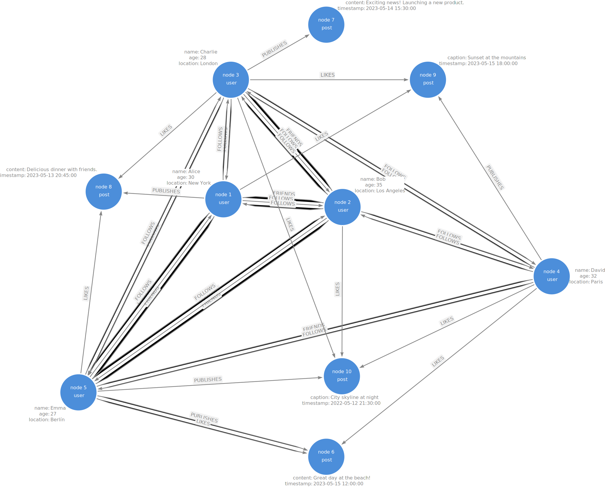

# **Examen Parcial - MdDyRS - 2024-08**

## **Asignatura:** Minearía de Datos y redes sociales.  
### **Profesora:** Alexandra Lemus

---

**Alumnos:**  
- Mariel Rivera Ruiz - 0275548
- Miguel Enrique Sepúlveda Furber - 0223986
- Luis Enrique Noguera Gil - 0196651

**Fecha de entrega:**  
26 de agosto de 2024

# Entregables
El entregable consiste en:
- Descripción de la metodología que utilizaste para crear el grafo aleatorio.
- Una imagen del modelo del grafo aleatorio en papel.
- Las respuestas a las preguntas del ejercicio 2.
- Una captura de pantalla del grafo en Arrows.
- Una captura de pantalla del grafo cargado en neo4j.

## Examen
Considera la siguiente información para definir una red social.

Existen 10 nodos con tres etiquetas:
- User
- Post
- Photo

Y los tipos posibles de relaciones entre estos nodos son los siguientes:
- FRIENDS (bidireccional entre dos nodos con etiqueta :user)
- FOLLOWS (unidireccional, comienza en un nodo y termina en otro con etiqueta :user)
- PUBLISHES (unidireccional, comienza en un nodo :user y termina en un nodo :post o :photo)
- LIKES ((unidireccional, comienza en un nodo :user y termina en un nodo :post o :photo))

### Ejercicio 1:
Define una metodología para crear un grafo (pseudo) aleatorio que relacione los nodos entre sí, utilizando los tipos de relaciones definidos.

#### Descripción de la metodología

### Ejercicio 2:
Utiliza [arrows.app](https://arrows.app/) para mapear tu grafo utilizando las etiquetas del grafo, los tipos de relación y las propiedades tanto de los nodos como las relaciones.

### Ejercicio 3:
Dibuja tu grafo (pseudo) aleatorio, en una hoja de papel, usando la metodología que definiste.

#### Esquema del grafo:




Una vez que dibujaste el grafo, responde lo siguiente:
- ¿Cuál es el nodo :user con mayor grado?

```cypher

```

- ¿Cuál es el nodo :post con mayor grado?

```cypher

```
- ¿Cuál es el nodo :photo de menor grado?

```cypher

```
- ¿Es un grafo fuertemente conexo?

```cypher

```

### Ejercicio 4:
Utiliza [arrows.app](https://arrows.app/) para generar el código Cypher y crear el nodo en Neo4j. Ejecuta este código en tu instancia de Neo4j Sandbox o Neo4j SandBox. 

Este formato incluye un enlace a arrows.app y proporciona una guía clara para la ejecución del código en Neo4j.

Enlace a la solución de [arrows.app]()

#### Constraints
```cypher
CREATE CONSTRAINT user IF NOT EXISTS FOR (u:User) REQUIRE u.user_id IS UNIQUE;
CREATE CONSTRAINT post IF NOT EXISTS FOR (p:Post) REQUIRE p.post_id IS UNIQUE;
CREATE CONSTRAINT photo IF NOT EXISTS FOR (ph:Photo) REQUIRE ph.photo_id IS UNIQUE;
```

#### Create Database
```cypher
CREATE 
(`node3`:user {name: "Charlie", age: 28, location: "London"})
  -[:LIKES]->(`node8`:post {content: "Delicious dinner with friends.", timestamp: "2023-05-13 20:45:00"})
  <-[:PUBLISHES]-(`node1`:user {name: "Alice", age: 30, location: "New York"})
  <-[:FOLLOWS]-(`node2`:user {name: "Bob", age: 35, location: "Los Angeles"})
  <-[:FOLLOWS]-(`node5`:user {name: "Emma", age: 27, location: "Berlín"})
  -[:FOLLOWS]->(`node1`)
  -[:FRIENDS]->(`node5`)
  <-[:FRIENDS]-(`node2`)
  <-[:FRIENDS]-(`node1`)
  -[:FOLLOWS]->(`node2`)
  -[:FOLLOWS]->(`node4`:user {name: "David", age: 32, location: "Paris"})
  <-[:FOLLOWS]-(`node3`)
  -[:FOLLOWS]->(`node1`)
  -[:FOLLOWS]->(`node5`)
  <-[:FOLLOWS]-(`node3`)
  <-[:FOLLOWS]-(`node4`)
  -[:FOLLOWS]->(`node2`)
  -[:LIKES]->(`node10`:post {caption: "City skyline at night", timestamp: "2022-05-12 21:30:00"})
  <-[:LIKES]-(`node3`)
  -[:LIKES]->(`node9`:post {caption: "Sunset at the mountains", timestamp: "2023-05-15 18:00:00"}),

(`node1`)-[:FOLLOWS]->(`node3`)
  <-[:FOLLOWS]-(`node2`)
  <-[:FOLLOWS]-(`node3`)
  -[:FRIENDS]->(`node2`)
  -[:FOLLOWS]->(`node5`)
  <-[:FOLLOWS]-(`node4`)
  -[:PUBLISHES]->(`node9`)
  <-[:LIKES]-(`node1`),

(:post {content: "Exciting news! Launching a new product.", timestamp: "2023-05-14 15:30:00"})
  <-[:PUBLISHES]-(`node3`)
  <-[:FOLLOWS]-(`node5`)
  -[:FRIENDS]->(`node4`)
  -[:LIKES]->(`node6`:post {content: "Great day at the beach!", timestamp: "2023-05-15 12:00:00"})
  <-[:LIKES]-(`node5`),

(`node4`)-[:LIKES]->(`node10`)
  <-[:PUBLISHES]-(`node5`)
  -[:PUBLISHES]->(`node6`),

(`node5`)-[:LIKES]->(`node8`)

```

### Ejercicio 5:
Crea consultas en CYPHER que contesten las siguientes preguntas:
- ¿Qué usuarios siguen a Charlie?
```cypher

```
- ¿Cuál es la post que tiene más likes?
```cypher

```
- Obtén todos los posts que tienen al menos 2 likes.
```cypher

```