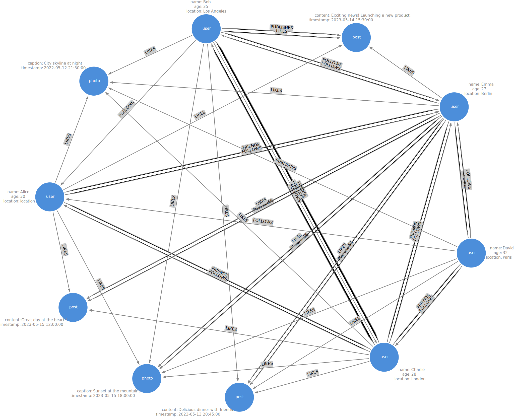

# **Examen Parcial - MdDyRS - 2024-08**

## **Asignatura:** Minearía de Datos y redes sociales.  
### **Profesora:** Alexandra Lemus

---

**Alumnos:**  
- Mariel Rivera Ruiz - 0275548
- Miguel Enrique Sepúlveda Furber - 0223986
- Luis Enrique Noguera Gil - 0196651

**Fecha de entrega:**  
26 de agosto de 2024

# Entregables
El entregable consiste en:
- Descripción de la metodología que utilizaste para crear el grafo aleatorio.
- Una imagen del modelo del grafo aleatorio en papel.
- Las respuestas a las preguntas del ejercicio 2.
- Una captura de pantalla del grafo en Arrows.
- Una captura de pantalla del grafo cargado en neo4j.

## Examen
Considera la siguiente información para definir una red social.

Existen 10 nodos con tres etiquetas:
- User
- Post
- Photo

Y los tipos posibles de relaciones entre estos nodos son los siguientes:
- FRIENDS (bidireccional entre dos nodos con etiqueta :user)
- FOLLOWS (unidireccional, comienza en un nodo y termina en otro con etiqueta :user)
- PUBLISHES (unidireccional, comienza en un nodo :user y termina en un nodo :post o :photo)
- LIKES ((unidireccional, comienza en un nodo :user y termina en un nodo :post o :photo))

### Ejercicio 1:
Define una metodología para crear un grafo (pseudo) aleatorio que relacione los nodos entre sí, utilizando los tipos de relaciones definidos.

#### Descripción de la metodología

El siguiente código simula las relaciones dentro de una red social mediante la creación de estructuras de datos que representan amistades (FRIENDS), seguimientos (FOLLOWS), publicaciones (PUBLISHES) y likes (LIKES). Esto permite modelar y analizar cómo los usuarios interactúan entre sí y cómo se comunica la red entre sí.

A continuación se detalla la metodología:

**Amistades:**

- Se calcula el número de combinaciones posibles para los usuarios dados, de tal manera que es el número máximo que puede haber de amistades. De forma aleatoria se asignan el número de amistades que habrá para ese dataset y, posteriormente, se asignan las amistades de forma random. Siempre existirá un mínimo de 4 amistades.

**Seguimientos ("Follows"):**

- En este caso si un usuario A sigue a B, B no necesariamente sigue a A. Para este paso, se calculan las permutaciones para determinar los seguimientos que pueden haber por usuarios. Se establece un número de follows de forma random y se lleva a cabo un muestreo sin reemplazo sobre la lista de permutaciones posibles. Siempre existirá un mínimo de 5 follows.

**Publicaciones:**

- Se itera sobre cada una de las publicaciones y se les asigna un usuario de manera aleatoria.

**Likes en Publicaciones:**

- Por cada usuario se decide de forma aleatoria a cuántas publicaciones le dará like. Posteriormente, se recoge una muestra sobre la lista de publicaciones totales (fotos + posts) con el número aleatorio de likes.

El código se encuentra en `notebooks\0.0-MESF-RandomNetwork.ipynb` de este repositorio. 

### Ejercicio 2:
Utiliza [arrows.app](https://arrows.app/) para mapear tu grafo utilizando las etiquetas del grafo, los tipos de relación y las propiedades tanto de los nodos como las relaciones.

### Ejercicio 3:
Dibuja tu grafo (pseudo) aleatorio, en una hoja de papel, usando la metodología que definiste.

#### Esquema del grafo:




Una vez que dibujaste el grafo, responde lo siguiente:
- ¿Cuál es el nodo :user con mayor grado?

```cypher

```

- ¿Cuál es el nodo :post con mayor grado?

```cypher

```
- ¿Cuál es el nodo :photo de menor grado?

```cypher

```
- ¿Es un grafo fuertemente conexo?

```cypher

```

### Ejercicio 4:
Utiliza [arrows.app](https://arrows.app/) para generar el código Cypher y crear el nodo en Neo4j. Ejecuta este código en tu instancia de Neo4j Sandbox o Neo4j SandBox. 

Este formato incluye un enlace a arrows.app y proporciona una guía clara para la ejecución del código en Neo4j.

Enlace a la solución de [arrows.app]()

#### Constraints
```cypher
CREATE CONSTRAINT user IF NOT EXISTS FOR (u:User) REQUIRE u.user_id IS UNIQUE;
CREATE CONSTRAINT post IF NOT EXISTS FOR (p:Post) REQUIRE p.post_id IS UNIQUE;
CREATE CONSTRAINT photo IF NOT EXISTS FOR (ph:Photo) REQUIRE ph.photo_id IS UNIQUE;
```

#### Create Database
```cypher
CREATE 
(n3:user {name: "David", age: 32, location: "Paris"})
  -[:LIKES]->(n7:post {content: "Delicious dinner with friends", timestamp: "2023-05-13 20:45:00"})
  <-[:LIKES]-(n2:user {name: "Charlie", age: 28, location: "London"})
  -[:FOLLOWS]->(n0:user {name: "Alice", age: 30, location: "location"})
  -[:FOLLOWS]->(n4:user {name: "Emma", age: 27, location: "Berlin"})
  <-[:FRIENDS]-(n2)
  -[:FRIENDS]->(n3)
  -[:FRIENDS]->(n4)
  <-[:FRIENDS]-(n0)
  -[:FRIENDS]->(n2)
  <-[:FOLLOWS]-(n1:user {name: "Bob", age: 35, location: "Los Angeles"})
  -[:FOLLOWS]->(n4)
  -[:FOLLOWS]->(n1)
  -[:FOLLOWS]->(n0)
  <-[:FOLLOWS]-(n3)
  -[:PUBLISHES]->(n9:photo {caption: "City skyline at night", timestamp: "2022-05-12 21:30:00"})
  <-[:LIKES]-(n0),

(n3)-[:LIKES]->(n8:photo {caption: "Sunset at the mountains", timestamp: "2023-05-15 18:00:00"})
  <-[:LIKES]-(n2)
  -[:FOLLOWS]->(n1)
  -[:FRIENDS]->(n2)
  <-[:FOLLOWS]-(n3)
  -[:FOLLOWS]->(n4)
  <-[:FOLLOWS]-(n2)
  -[:LIKES]->(n5:post {content: "Great day at the beach!", timestamp: "2023-05-15 12:00:00"})
  <-[:LIKES]-(n4)
  -[:LIKES]->(n9),

(n6:post {content: "Exciting news! Launching a new product.", timestamp: "2023-05-14 15:30:00"})
  <-[:LIKES]-(n4)
  -[:LIKES]->(n8)
  <-[:LIKES]-(n1)
  -[:PUBLISHES]->(n6)
  <-[:LIKES]-(n0),

(n0)-[:LIKES]->(n8)
  <-[:PUBLISHES]-(n4)
  -[:PUBLISHES]->(n5)
  <-[:LIKES]-(n0),

(n7)<-[:LIKES]-(n4)
  -[:PUBLISHES]->(n7)
  <-[:LIKES]-(n1)
  -[:LIKES]->(n9)
  <-[:LIKES]-(n2),

(n1)-[:LIKES]->(n6)
```

### Ejercicio 5:
Crea consultas en CYPHER que contesten las siguientes preguntas:
- ¿Qué usuarios siguen a Charlie?
```cypher

```
- ¿Cuál es la post que tiene más likes?
```cypher

```
- Obtén todos los posts que tienen al menos 2 likes.
```cypher

```